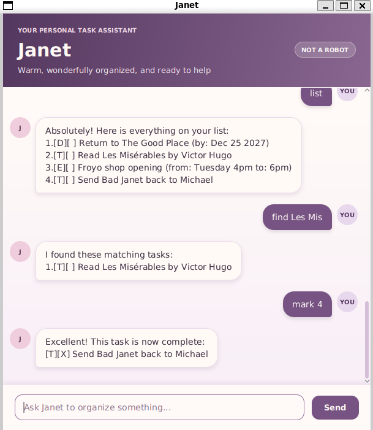

# Janet

Janet is a friendly desktop task manager for keeping track of to-dos, deadlines, and events. It uses a simple
chat-style interface, saves changes automatically, and restores your tasks the next time you start it.



The character is inspired by Janet from *The Good Place*: cheerful, literal, unfailingly helpful, and always quick
to point out that she is “not a robot.” That personality gives Janet warm, encouraging responses while she helps
you stay organized.

## What Janet can do

- Add to-dos, dated deadlines, and events with flexible start and end descriptions.
- List, find, complete, reopen, and delete tasks.
- Delete several tasks safely in one command.
- Keep task data between sessions in a local `data/janet.txt` file.
- Protect an existing data file if Janet detects unreadable or malformed saved content.

## Getting started

Janet requires Java 25.

### Run the packaged application

Place `janet.jar` in a folder where Janet may create a `data` subfolder. Open a terminal in that folder and run:

```bash
java -jar janet.jar
```

The Janet window will open. Type a command in the message box and press <kbd>Enter</kbd>, or click **Send**.

Try this short tour:

```text
todo read book
deadline return book /by 2026-09-30
list
mark 1
```

Janet saves successful changes automatically. Keep the generated `data` folder with the JAR if you move the
application to another location.

## Commands at a glance

| Action | Command | Example |
| --- | --- | --- |
| Add a to-do | `todo DESCRIPTION` | `todo read book` |
| Add a deadline | `deadline DESCRIPTION /by YYYY-MM-DD` | `deadline return book /by 2026-09-30` |
| Add an event | `event DESCRIPTION /from START /to END` | `event meeting /from Monday 2pm /to 4pm` |
| Show all tasks | `list` | `list` |
| Complete a task | `mark NUMBER` | `mark 2` |
| Reopen a task | `unmark NUMBER` | `unmark 2` |
| Find tasks | `find KEYWORD` | `find book` |
| Delete one or more tasks | `delete NUMBER [NUMBER ...]` | `delete 2 4 5` |
| Exit Janet | `bye` | `bye` |

Task numbers come from `list`. Command names are not case-sensitive; search text used by `find` is case-sensitive.
For command details, examples, and data-recovery guidance, see the [Janet User Guide](docs/README.md).

## Build from source

You need JDK 25. Clone the repository, open a terminal in its root, and use the included Gradle wrapper:

```bash
./gradlew run
```

To build the packaged application instead:

```bash
./gradlew shadowJar
java -jar build/libs/janet.jar
```

On Windows, replace `./gradlew` with `gradlew.bat`. Run the automated tests with `./gradlew test`.

## AI usage

OpenAI Codex was used while developing this project to generate and refactor Java code, create the project-specific
UI testing tools and test plan, and run defined test plans. The generated changes, final designs, wording, and test
results were reviewed by the project author.
